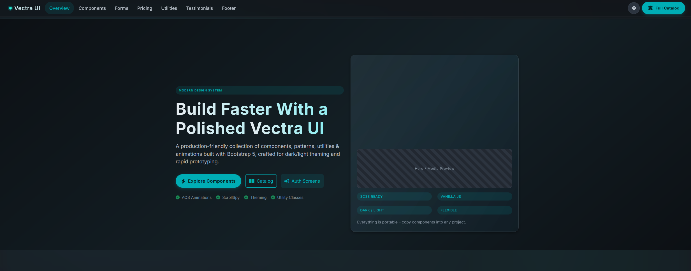
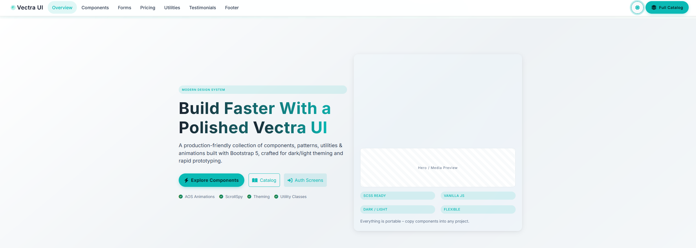
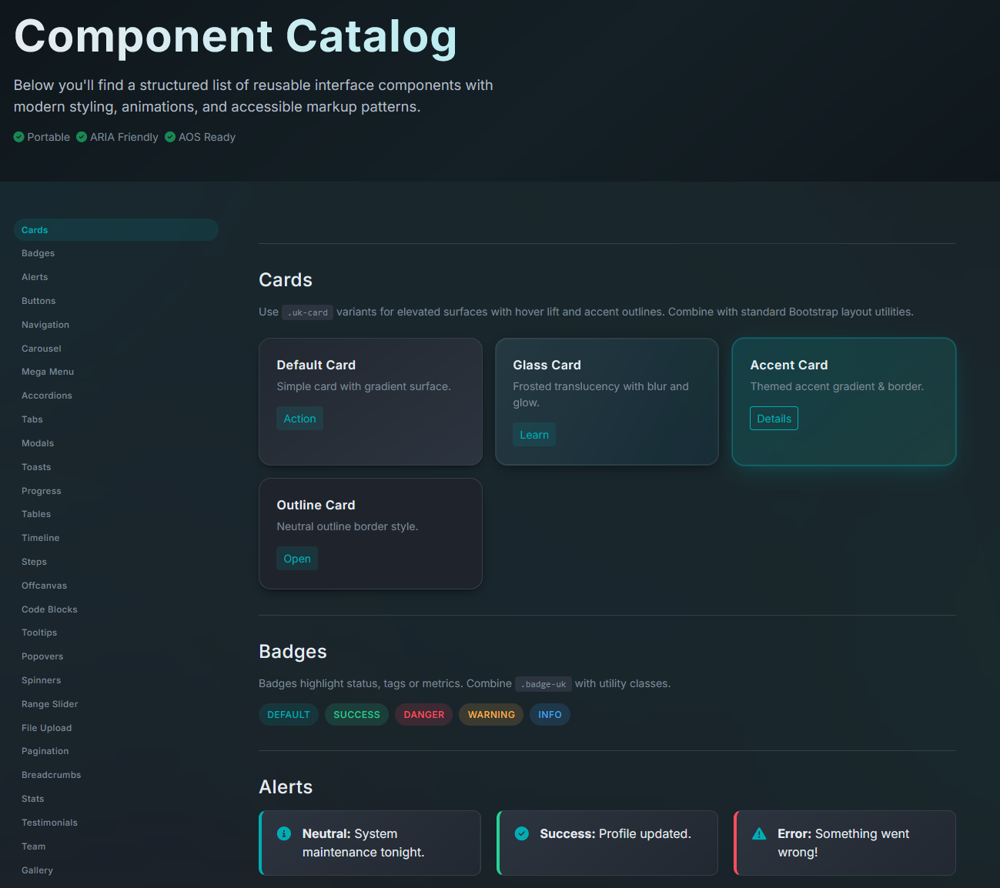
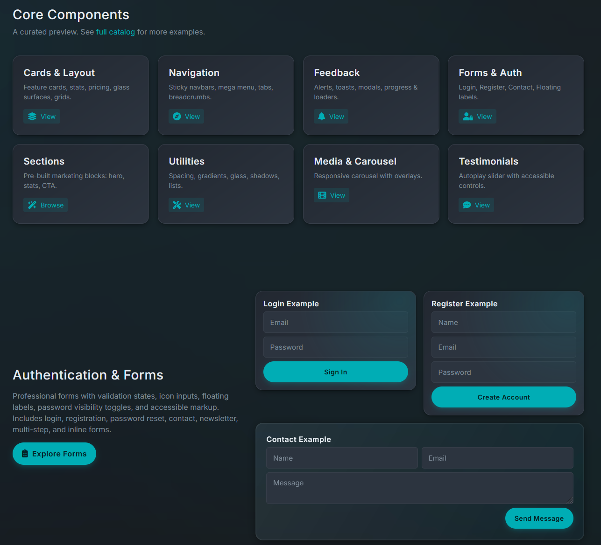

<div align="center"><div align="center">


# 🚀 Vectra UI Kit# 🚀 Vectra UI Kit


### A Premium, Production-Ready Design System### A Premium, Production-Ready Design System


**Modern · Responsive · Accessible · Free Forever****Modern · Responsive · Accessible · Free Forever**


[](LICENSE)[](LICENSE)

[](https://getbootstrap.com/)[](https://getbootstrap.com/)

[](#features)[](#)


[Live Demo](https://xttrust.github.io/Vectra-UI-KIT/) · [Components](#-component-library) · [Documentation](docs.html) · [Report Bug](https://github.com/xttrust/Vectra-UI-KIT/issues)[Live Demo](https://xttrust.github.io/Vectra-UI-KIT/) · [Components](components.html) · [Documentation](docs.html) · [Report Bug](https://github.com/xttrust/Vectra-UI-KIT/issues)


</div></div>


------


## 📸 Preview## 📸 Preview


### 🌙 Dark Theme### 🌙 Dark Theme



*Sleek dark theme with vibrant teal/cyan accents*


*Sleek dark theme with vibrant teal/cyan accents*### ☀️ Light Theme



### ☀️ Light Theme*Clean light theme with premium slate tones*


### 🎨 Components Showcase



*Clean light theme with premium slate tones**50+ production-ready components*


### 🎨 Components Showcase

*Cards, forms, buttons, and more*


---

*50+ production-ready components*

## ✨ Features


Vectra UI is a fast, portable design system built with HTML, CSS (design tokens), and Bootstrap 5. It delivers a polished dark/cyan aesthetic, accessible components, marketing sections, form flows, and a layer of vanilla JavaScript. **No build steps required**—copy the components you need and ship.

*Cards, forms, buttons, and more*### 🎯 Key Highlights


---- **🎨 Dual Theme System** - Beautiful dark & light modes with smooth transitions

- **⚡ Zero Build Required** - Pure HTML, CSS, and vanilla JavaScript

## ✨ Features- **📦 50+ Components** - Production-ready UI primitives and complex patterns

- **🎭 Design Tokens** - CSS variables for easy customization

Vectra UI is a fast, portable design system built with HTML, CSS (design tokens), and Bootstrap 5. It delivers a polished dark/cyan aesthetic, accessible components, marketing sections, form flows, and a layer of vanilla JavaScript. **No build steps required**—copy the components you need and ship.- **♿ Accessibility First** - WCAG compliant with semantic HTML and ARIA labels

- **📱 Fully Responsive** - Mobile-first design that works everywhere

### 🎯 Key Highlights- **🚀 Bootstrap 5.3+ Powered** - Built on the world's most popular framework

- **🎪 Rich Animations** - AOS (Animate On Scroll) integration

- **🎨 Dual Theme System** - Beautiful dark & light modes with smooth transitions- **💼 Production Ready** - Used in real-world SaaS applications

- **⚡ Zero Build Required** - Pure HTML, CSS, and vanilla JavaScript

- **📦 50+ Components** - Production-ready UI primitives and complex patterns### 🛠️ Tech Stack

- **🎭 Design Tokens** - CSS variables for easy customization

- **♿ Accessibility First** - WCAG compliant with semantic HTML and ARIA labels- **HTML5** - Semantic markup

- **📱 Fully Responsive** - Mobile-first design that works everywhere- **CSS3** - Modern features (Grid, Flexbox, Custom Properties)

- **🚀 Bootstrap 5.3+ Powered** - Built on the world's most popular framework- **Bootstrap 5.3+** - Component framework

- **🎪 Rich Animations** - AOS (Animate On Scroll) integration- **Font Awesome 6+** - Icon library

- **💼 Production Ready** - Used in real-world SaaS applications- **AOS** - Scroll animations

- **Vanilla JavaScript** - No framework dependencies

### 🛠️ Tech Stack

---

- **HTML5** - Semantic markup

- **CSS3** - Modern features (Grid, Flexbox, Custom Properties)## 🚀 Quick Start

- **Bootstrap 5.3+** - Component framework

- **Font Awesome 6+** - Icon library### Option 1: Clone the Repository

- **AOS** - Scroll animations

- **Vanilla JavaScript** - No framework dependencies```bash

git clone https://github.com/xttrust/Vectra-UI-KIT.git

---cd Vectra-UI-KIT

```

## 🚀 Quick Start

Open `index.html` in your browser - that's it! No build process required.

### Option 1: Clone the Repository

### Option 2: Download ZIP

```bash

git clone https://github.com/xttrust/Vectra-UI-KIT.git[Download the latest release](https://github.com/xttrust/Vectra-UI-KIT/archive/refs/heads/main.zip) and extract it.

cd Vectra-UI-KIT

```### Option 3: Use Individual Components


Open `index.html` in your browser - that's it! No build process required.Copy/paste component blocks from:

- `components.html` - UI primitives and complex components

### Option 2: Download ZIP- `sections.html` - Marketing and landing sections

- `forms.html` - Auth, contact, and multi-step form patterns

[Download the latest release](https://github.com/xttrust/Vectra-UI-KIT/archive/refs/heads/main.zip) and extract it.- `pricing.html` - Pricing tables and plan displays


### Option 3: Use Individual Components---


Copy/paste component blocks from:## Project Structure


- `components.html` - UI primitives and complex components```text

- `sections.html` - Marketing and landing sections.

- `forms.html` - Auth, contact, and multi-step form patterns  README.md

- `pricing.html` - Pricing tables and plan displays  index.html          # Landing / Overview

  components.html     # Component catalog (UI primitives + complex)

---  sections.html       # Marketing / landing section library

  forms.html          # Auth + contact + newsletter + multi-step patterns

## 📁 Project Structure  pricing.html        # Pricing tables & plan teasers

  utilities.html      # Utility classes + design tokens

```text  docs.html           # How to use & extend (guide)

Vectra-UI-KIT/  assets/

├── 📄 index.html          # Landing page & overview    css/

├── 📄 components.html     # Complete component catalog      ui-kit.css      # Core: tokens, base, components, sections

├── 📄 sections.html       # Marketing section library      auth.css        # Auth/profile page styles

├── 📄 forms.html          # Form patterns & authentication    js/

├── 📄 pricing.html        # Pricing tables & plans      ui-kit.js       # Progressive enhancements (optional)

├── 📄 utilities.html      # Utility classes reference    img/              # Placeholder / demo imagery (optional)

├── 📄 docs.html           # Documentation & guides```

├── 📁 assets/

│   ├── 📁 css/---

│   │   ├── ui-kit.css     # Core styles (design tokens + components)

│   │   └── auth.css       # Authentication page styles## Highlights

│   ├── 📁 js/

│   │   └── ui-kit.js      # Interactive enhancements* Pure HTML + Bootstrap 5 components (no custom build pipeline)

│   └── 📁 img/            # Demo images* CSS variables for color, spacing, radius, elevation, motion

├── 📁 auth/* Dark/Light themes via `[data-theme]` attribute + localStorage persistence

│   ├── login.html         # Login page* Layered design tokens → components → section utilities

│   ├── register.html      # Registration page* Accessible markup emphasis (headings, focus rings, aria roles where meaningful)

│   ├── recover.html       # Password recovery* Progressive enhancement: page still works if JS fails

│   └── profile.html       # User profile* Small, composable utilities instead of deeply nested overrides

├── 📁 docs/

│   └── 📁 img/            # Documentation screenshots---

└── 📄 LICENSE             # MIT License

```## Component & Section Coverage


---Legend: ✅ Implemented | 🧩 Planned / simple to add | ⏳ Future / optional | (blank = not targeted yet)


## 🎨 Component Library### Layout & Structure

| Item | Status | Notes |

### Layout & Structure|------|--------|-------|

| Header / Navbar (sticky / transparent) | ✅ | `.uk-navbar` with blur + scroll state |

| Component | Status | Description || Hero (gradient, centered, split, minimal) | ✅ | Variants in `sections.html` & `index.html` |

|-----------|--------|-------------|| Reusable cards / panels | ✅ | `.uk-card` variants (glass, accent, outline, elevated) |

| Navbar (Sticky/Transparent) | ✅ | Responsive navigation with blur effects |

| Hero Sections | ✅ | Gradient, centered, split, minimal variants |### Navigation & Menus

| Cards & Panels | ✅ | Glass, accent, outline, elevated styles || Item | Status | Notes |

| Grid System | ✅ | Bootstrap 5 grid with custom utilities ||------|--------|-------|

| Footer | ✅ | Multi-column footer with social links || Top navigation bar | ✅ | Responsive collapse |

| Sidebar (catalog) | ✅ | `.uk-side-nav` click-activated |

### Navigation & Menus| Breadcrumbs, Pagination, Tabs, Accordion | ✅ | Themed Bootstrap components |

| Offcanvas / Mega menu | ✅ | Demos included |

| Component | Status | Description |

|-----------|--------|-------------|### Content Presentation

| Top Navigation | ✅ | Responsive collapse with theme toggle || Item | Status | Notes |

| Sidebar Navigation | ✅ | Scrollspy-enabled catalog navigation ||------|--------|-------|

| Breadcrumbs | ✅ | Themed breadcrumb navigation || Typography / text utilities | ✅ | Base type + dim/alt tokens |

| Tabs | ✅ | Styled tabs with active state || Testimonials | ✅ | Custom slider with ARIA roles |

| Pagination | ✅ | Page navigation component || Carousel | ✅ | Themed Bootstrap carousel |

| Accordion | ✅ | Collapsible content panels || Modals, Tooltips, Popovers | ✅ | Styled surfaces |

| Offcanvas | ✅ | Slide-in side panels || Progress / Timeline | ✅ | `.progress-uk` + `.timeline` |


### Content & Display### Forms & Input

| Item | Status | Notes |

| Component | Status | Description ||------|--------|-------|

|-----------|--------|-------------|| Auth (login/register/reset) | ✅ | Panels + states |

| Typography | ✅ | Heading styles, text utilities, gradient text || Contact / Newsletter | ✅ | Patterns included |

| Testimonials | ✅ | Slider with autoplay and ARIA || Multi‑step / wizard | ✅ | `steps` + example |

| Carousel | ✅ | Image carousel with controls || Range / Spinners (showcase) | 🧩 | Styling ready |

| Modals | ✅ | Dialog boxes with backdrop |

| Tooltips & Popovers | ✅ | Contextual overlays |### SaaS / Marketing

| Progress Bars | ✅ | Animated progress indicators || Item | Status | Notes |

| Timeline | ✅ | Vertical timeline component ||------|--------|-------|

| Badges | ✅ | Status and label badges || Pricing tables & teaser | ✅ | `pricing.html` |

| Alerts | ✅ | Notification messages || Comparison table | 🧩 | Example in catalog |

| Product cards | ✅ | E‑commerce ready |

### Forms & Input| Logos, CTA, FAQ, Newsletter | ✅ | Section library


| Component | Status | Description |---

|-----------|--------|-------------|

| Text Inputs | ✅ | Standard and floating label variants |## Utilities & Design Tokens

| Select Dropdowns | ✅ | Styled select elements |

| Checkboxes & Radios | ✅ | Custom styled form controls |Core tokens defined in `assets/css/ui-kit.css`:

| Switches | ✅ | Toggle switches |

| Range Sliders | ✅ | Styled range inputs |* Colors, gradients, accent glow

| File Upload | ✅ | Custom file input styling |* Typography stacks & heading weights

| Multi-Step Forms | ✅ | Wizard with progress indicators |* Radii (xs → pill) & elevation scale

| Auth Panels | ✅ | Login, register, password recovery |* Transitions & motion helpers

| Form Validation | ✅ | Error and success states |* Spacing helpers: `.px-gutter`, `.mt-6`, `.py-6`, width constraints (`.max-w-*`)

* Effects: glass (`.uk-card-glass`, `.glass`), gradient text (`.gradient-text`), elevation hover (`.uk-elevate-hover`), outline/hover, fade/scale animations

### SaaS & Marketing* Marketing utilities: `.feature-grid`, `.logo-grid`, `.overlap-row`, `.pricing-teaser`, `.cta-wide`, `.newsletter-slim`, `.contact-grid`


| Component | Status | Description |---

|-----------|--------|-------------|

| Pricing Tables | ✅ | Feature comparison and plan cards |## JavaScript (Optional Layer)

| Product Cards | ✅ | E-commerce ready product displays |

| Team Section | ✅ | Team member cards with social links |`assets/js/ui-kit.js` adds:

| FAQ Section | ✅ | Accordion-style frequently asked questions |

| CTA Sections | ✅ | Call-to-action blocks |* Theme toggle (persisted)

| Newsletter Forms | ✅ | Email subscription forms |* Back‑to‑top reveal

| Stats/Counters | ✅ | Animated statistics display |* Copy‑to‑clipboard for code blocks

| Logo Grid | ✅ | Client/partner logo showcase |* KPI / stat counters (IntersectionObserver)

| Gallery | ✅ | Image grid layouts |* Testimonial slider (translate track + autoplay)

| Blog Cards | ✅ | Article preview cards |* Sidebar click → smooth scroll + active state

| Cookie Banner | ✅ | GDPR compliance notice |* AOS init with defensive fallback

| Floating Action Button | ✅ | FAB for quick actions |

| Share Buttons | ✅ | Social media sharing |The site renders without JS (progressive enhancement by design).


------


## 🎯 Design System## Theming & Customization


### Color PaletteOverride `--uk-accent` and related tokens to rebrand. You can also scope themes using an attribute on `<body>` or `<html>`.


**Dark Theme:**---


- Background: `#0A0F1E` (Deep navy)## License

- Surface: `#0F1828` (Dark slate)

- Text: `#E2E8F0` (Light gray)MIT. See `LICENSE`.

- Accent: `#00ADB5` → `#56DFCF` (Teal/cyan gradient)

---

**Light Theme:**

## Credit

- Background: `#FAFBFC` (Off-white)

- Surface: `#FFFFFF` (Pure white)Originally authored by Florin Pinta (xttrust). Rebranded and customized as “Vectra UI”.

- Text: `#0F172A` (Deep slate)

- Accent: `#0ABAB5` → `#ADEED9` (Teal gradient with pink highlights)---


### Typography## Happy shipping. 🚀


- **Headings**: Inter (700-800 weight)
- **Body**: Inter (400-500 weight)
- **Code**: Fira Code

### Spacing Scale

`0.25rem` · `0.5rem` · `0.75rem` · `1rem` · `1.5rem` · `2rem` · `3rem` · `4rem` · `6rem`

### Border Radius

- `xs`: 4px
- `sm`: 6px
- `md`: 8px (default)
- `lg`: 12px
- `xl`: 16px
- `pill`: 999px

---

## 💡 Usage Examples

### Theme Toggle

```html
<button id="themeToggle" class="btn btn-icon">
  <i class="fas fa-moon"></i>
</button>
```

The theme automatically persists to localStorage and applies on page load.

### Component Example - Card

```html
<div class="uk-card uk-card-glass">
  <div class="uk-card-body">
    <h5 class="uk-card-title">Card Title</h5>
    <p class="uk-card-text">Card content goes here.</p>
    <a href="#" class="btn btn-accent">Learn More</a>
  </div>
</div>
```

### Component Example - Hero Section

```html
<section class="hero gradient-bg">
  <div class="container">
    <div class="hero-content text-center">
      <h1 class="hero-title">Welcome to Vectra UI</h1>
      <p class="hero-subtitle">Build faster with premium components</p>
      <a href="#" class="btn btn-accent btn-lg">Get Started</a>
    </div>
  </div>
</section>
```

---

## 🔧 Customization

### Changing Colors

Override CSS custom properties in your own stylesheet:

```css
:root {
  --uk-accent: #FF6B6B;        /* Your brand color */
  --uk-accent-alt: #FFE66D;    /* Secondary color */
  --uk-radius-md: 16px;        /* Border radius */
}
```

### Custom Theme

Create a custom theme by adding a data attribute:

```html
<html data-theme="custom">
```

```css
[data-theme="custom"] {
  --uk-bg: #yourColor;
  --uk-text: #yourColor;
  /* ... other variables */
}
```

---

## 🚀 JavaScript Features

The optional `ui-kit.js` file provides:

- **Theme Toggle** - Persistent dark/light mode switching
- **Back to Top** - Smooth scroll to top button
- **Code Copy** - One-click code snippet copying
- **Stat Counters** - Animated number counting
- **Testimonial Slider** - Auto-playing testimonial carousel
- **Sidebar Navigation** - Smooth scrolling and active states
- **AOS Integration** - Scroll-triggered animations

**Progressive Enhancement**: The site works perfectly without JavaScript!

---

## 📱 Browser Support

- ✅ Chrome (latest)
- ✅ Firefox (latest)
- ✅ Safari (latest)
- ✅ Edge (latest)
- ⚠️ IE11 (not supported - requires modern CSS features)

---

## 🤝 Contributing

Contributions are welcome! Feel free to:

1. Fork the repository
2. Create a feature branch (`git checkout -b feature/AmazingFeature`)
3. Commit your changes (`git commit -m 'Add some AmazingFeature'`)
4. Push to the branch (`git push origin feature/AmazingFeature`)
5. Open a Pull Request

---

## 📄 License

This project is licensed under the **MIT License** - see the [LICENSE](LICENSE) file for details.

**You are free to:**

- ✅ Use commercially
- ✅ Modify and adapt
- ✅ Distribute
- ✅ Use privately

**No attribution required** - but appreciated! ⭐

---

## 👨‍💻 Author

**Florin Pinta** ([@xttrust](https://github.com/xttrust))

---

## 🙏 Acknowledgments

- [Bootstrap](https://getbootstrap.com/) - Component framework
- [Font Awesome](https://fontawesome.com/) - Icon library
- [AOS](https://michalsnik.github.io/aos/) - Animate on scroll library
- [Inter](https://rsms.me/inter/) - Typography

---

## 🌟 Show Your Support

If you find this project useful, please consider:

- ⭐ Starring the repository
- 🐛 Reporting bugs and issues
- 💡 Suggesting new features
- 📢 Sharing with others
- ☕ [Buy me a coffee](https://github.com/sponsors/xttrust) (optional)

---

<div align="center">

### 🚀 Built with ❤️ by [Florin Pinta](https://github.com/xttrust)

**[⬆ Back to Top](#-vectra-ui-kit)**

</div>
